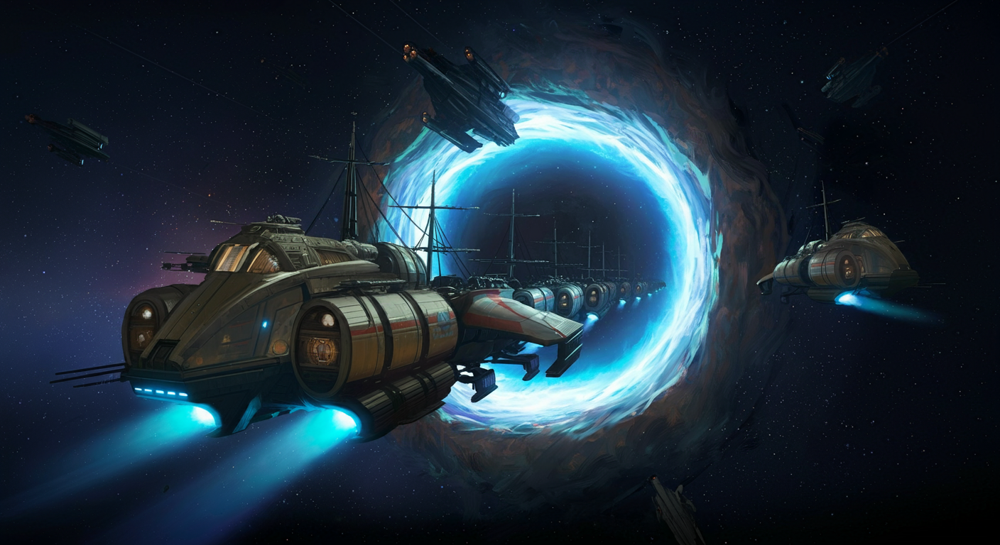

# The Kepler Trail

The game inspired by "[The Oregon Trail](https://en.wikipedia.org/wiki/Oregon_Trail)"

## Concept

The year is 2345, Humanity has reached for the stars! Earth is thriving, but the adventurous spirit of our species calls us beyond the cradle of our homeworld. You and your fellow explorers have been chosen for the maiden voyage of the “Pioneer”, a starship bound for the **Kepler-186f**. This journey to a new world, **580 light-years** away, is a testament to human ingenuity and our endless pursuit of knowledge.

This is a text-based adventure game where players journey across a procedurally generated world, powered by Gemma (or Gemini). The LLM dynamically creates encounters, obstacles, and opportunities based on player choices and actions. This game leverages the power of LLM to create a truly replayable and unpredictable experience, where every journey is unique and player choices shape the story in meaningful ways.
